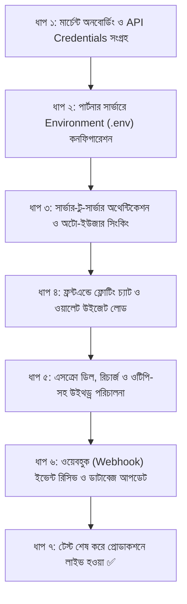

# 🚀 SafnexBD Partner Integration Master Roadmap
### অন্য যেকোনো ওয়েবসাইট থেকে সেফনেক্সবিডি এপিআই ও ওয়ালেট-চ্যাট ইন্টিগ্রেশনের পূর্ণাঙ্গ গাইডলাইন ও রোডম্যাপ

---

## ১. ভূমিকা ও আর্কিটেকচার রোডম্যাপ (Architecture Overview)

আপনার ক্লায়েন্ট বা পার্টনারের ওয়েবসাইটটি যে টেকনোলজিতেই তৈরি হোক না কেন—**WordPress, Laravel/PHP, React, Next.js, Python (Django/FastAPI), অথবা Node.js**—তারা খুব সহজেই সেফনেক্সবিডির কোর ইঞ্জিন যুক্ত করতে পারবে।



---

## ২. ইন্টিগ্রেশনের ৫টি মূল পর্যায় (The 5 Core Phases)

---

### পর্যায় ১: সেফনেক্সবিডি ডেভেলপার ক্রেডেনশিয়াল সংগ্রহ (Credentials Setup)

পার্টনার ওয়েবসাইট ওনার প্রথমে সেফনেক্সবিডিতে একটি মার্চেন্ট অ্যাকাউন্ট তৈরি করবে এবং নিচের তথ্যগুলো সংগ্রহ করবে:

| ক্রেডেনশিয়াল নাম | উদাহরণ | ব্যবহারের ক্ষেত্র | কোথায় থাকবে? |
|---|---|---|---|
| **`App ID`** | `app_live_8912abcd34` | পার্টনারের ইউনিক আইডেন্টিফায়ার | ফ্রন্টএন্ড ও ব্যাকএন্ড উভয় জায়গায় |
| **`API Key (Public)`** | `pk_live_776655aabb` | ফ্রন্টএন্ড উইজেট বা SDK ইনিশিয়ালাইজ করতে | ব্রাউজারে পাবলিকলি থাকতে পারবে |
| **`Secret Key (Private)`** | `sk_live_9988776655` | আর্থিক লেনদেন, ব্যালেন্স চেক ও সিগনেচার তৈরিতে | **শুধুমাত্র পার্টনারের ব্যাকএন্ড সার্ভারে (কখনও ফ্রন্টএন্ডে নয়)** |
| **`Webhook Secret`** | `whsec_33221100ff` | সেফনেক্সবিডি থেকে আসা নোটিফিকেশন ভেরিফাই করতে | শুধুমাত্র পার্টনারের ব্যাকএন্ড সার্ভারে |

> 🔒 **নিরাপত্তা সতর্কতা:** পার্টনার তাদের সেফনেক্সবিডি মার্চেন্ট ড্যাশবোর্ডে গিয়ে অবশ্যই তাদের ওয়েবসাইটের ডোমেইন (যেমন: `https://clientstore.com`) **Allowed Domains / CORS Whitelist**-এ সেভ করে রাখবে।

---

### পর্যায় ২: পার্টনারের সার্ভারে Environment (.env) কনফিগারেশন

পার্টনার ওয়েবসাইট তাদের সার্ভারের সিক্রেট ফাইলে ক্রেডেনশিয়ালগুলো রাখবে:

```env
# পার্টনারের .env ফাইল
SAFNEXBD_APP_ID=app_live_8912abcd34
SAFNEXBD_API_KEY=pk_live_776655aabb
SAFNEXBD_API_SECRET=sk_live_9988776655
SAFNEXBD_WEBHOOK_SECRET=whsec_33221100ff
SAFNEXBD_BASE_URL=https://safnexbd.com/api/v1
```

---

### পর্যায় ৩: ইউজার সিংকিং ও সেশন অথেন্টিকেশন (Silent Auto-Provisioning)

পার্টনার সাইটের ইউজারদের সেফনেক্সবিডিতে নতুন করে সাইন-আপ করতে হবে না। 
পার্টনার সাইটে ইউজার লগইন থাকা অবস্থায় পার্টনারের ব্যাকএন্ড সার্ভার সেফনেক্সবিডিকে নিচের মতো একটি রিকোয়েস্ট পাঠাবে:

#### এপিআই এন্ডপয়েন্ট:
`POST https://safnexbd.com/api/v1/partner/auth/session`

#### রিকোয়েস্ট হেডারস:
```http
Content-Type: application/json
X-Safnex-App-Id: app_live_8912abcd34
X-Safnex-Signature: <HMAC-SHA256-Hash-with-API-Secret>
X-Safnex-Timestamp: 1695123456
```

#### রিকোয়েস্ট বডি (JSON):
```json
{
  "partnerUserId": "client_user_582",
  "name": "Rahim Ahmed",
  "phone": "01711111111",
  "email": "rahim@gmail.com"
}
```

#### সিগনেচার তৈরির নিয়ম (HMAC-SHA256):
```text
Signature = HMAC_SHA256(JSON_Body_String, SAFNEXBD_API_SECRET)
```

#### সেফনেক্সবিডির রেসপন্স:
```json
{
  "success": true,
  "data": {
    "sessionToken": "tbd_sess_9a8b7c6d5e...",
    "expiresIn": 3600,
    "user": {
      "safnexId": "usr_v_109283",
      "name": "Rahim Ahmed",
      "availableBalance": 2500.00,
      "holdBalance": 500.00
    }
  }
}
```

---

### পর্যায় ৪: ফ্রন্টএন্ডে ফ্লোটিং চ্যাট ও ওয়ালেট উইজেট লোড করা (UI/SDK)

পার্টনার ওয়েবসাইটের ফুটারে বা লেআউট ফাইলে নিচের লাইটওয়েট স্ক্রিপ্টটি বসিয়ে দিলেই কাজ শেষ:

```html
<!-- সেফনেক্সবিডি জাভাস্ক্রিপ্ট SDK -->
<script src="https://safnexbd.com/sdk/safnexbd-sdk.js" async></script>

<script>
  window.addEventListener('DOMContentLoaded', async () => {
    // ১. পার্টনারের ব্যাকএন্ড থেকে সেশন টোকেন আনুন
    const response = await fetch('/api/safnex/get-session');
    const { sessionToken } = await response.json();

    // ২. সেফনেক্সবিডি উইজেট চালু করুন
    if (sessionToken && window.SafnexBD) {
      window.SafnexBD.init({
        appId: 'app_live_8912abcd34',
        sessionToken: sessionToken,
        theme: 'dark', // 'dark' অথবা 'light'
        position: 'bottom-right', // 'bottom-right' অথবা 'bottom-left'
        features: {
          chat: true,      // লাইভ চ্যাট সক্রিয়
          wallet: true,    // ব্যালেন্স ও লেনদেন সক্রিয়
          escrow: true     // এসক্রো পেমেন্ট সক্রিয়
        }
      });
    }
  });
</script>
```

#### এটি পার্টনার ওয়েবসাইটে যেভাবে দেখাবে:
1. স্ক্রিনের নিচে ডানপাশে একটি স্টাইলিশ ফ্লোটিং ব্যাজ ভেসে উঠবে।
2. ইউজার ক্লিক করলে একটি মিনি স্লিম উইন্ডো ওপেন হবে।
3. **ট্যাব ১ (Chat):** পার্টনারের সেলার বা সাপোর্ট এজেন্টের সাথে রিয়েলটাইম চ্যাট ও ফাইল শেয়ারিং।
4. **ট্যাব ২ (Wallet):** বর্তমান ব্যালেন্স, ইনস্ট্যান্ট রিচার্জ ও ওটিপি সহ উইথড্র অপশন।

---

### পর্যায় ৫: আর্থিক লেনদেন, রিচার্জ ও উইথড্র ফ্লো

#### ক. ওয়ালেট রিচার্জ (Recharge Flow):
1. ইউজার যখন ওয়ালেট থেকে `রিচার্জ` বাটনে ক্লিক করবে:
2. সেফনেক্সবিডির পেমেন্ট গেটওয়ে (bKash/Nagad/Rocket/Cards) ওপেন হবে।
3. টাকা সফলভাবে জমা হলে সেফনেক্সবিডির ওয়ালেটে ব্যালেন্স সাথে সাথে ক্রেডিট হয়ে যাবে।
4. সেফনেক্সবিডি পার্টনারের সার্ভারে Webhook পাঠাবে।

#### খ. টাকা উত্তোলন (Withdraw Flow with OTP):
1. ইউজার কত টাকা এবং কোন নম্বরে (bKash/Nagad/Bank) উইথড্র করতে চায় তা সিলেক্ট করে সাবমিট করবে।
2. **ওটিপি ভেরিফিকেশন:** সেফনেক্সবিডি স্বয়ংক্রিয়ভাবে ইউজারের ফোনে ৬-সংখ্যার ওটিপি পাঠাবে।
3. ওটিপি সঠিক হলে সেফনেক্সবিডির ওয়ালেট থেকে ব্যালেন্স কেটে পেন্ডিং লেজার তৈরি হবে এবং অ্যাডমিন অনুমোদন করলে টাকা কাস্টমারের অ্যাকাউন্টে পৌঁছে যাবে।

#### গ. এসক্রো লেনদেন (Escrow Deal - টাকা হোল্ড ও রিলিজ):
1. **চুক্তি তৈরি:** পার্টনারের কাস্টমার কোনো অর্ডার দিলে পার্টনার সার্ভার `POST /api/v1/partner/escrow/create` কল করবে।
2. **টাকা হোল্ড:** কাস্টমারের ব্যালেন্স থেকে টাকা কেটে সেফনেক্সবিডির এসক্রোতে **Hold Balance** হয়ে থাকবে। বিক্রেতা ডেলিভারি না দেওয়া পর্যন্ত টাকা লক থাকবে।
3. **টাকা রিলিজ:** অর্ডার ডেলিভারি নিশ্চিত হলে পার্টনার সার্ভার `POST /api/v1/partner/escrow/release` কল করবে। সাথে সাথে সেফনেক্সবিডি প্ল্যাটফর্ম ফি কেটে বাকি টাকা বিক্রেতার ওয়ালেটে রিলিজ করে দেবে!

---

### পর্যায় ৬: পার্টনারের সার্ভারে Webhook হ্যান্ডলিং (Realtime Updates)

রিচার্জ সফল হওয়া, উইথড্র কনফার্মেশন বা কোনো লেনদেন ঘটলে সেফনেক্সবিডি পার্টনারের `Webhook URL`-এ একটি সিকিউরড POST রিকোয়েস্ট পাঠাবে।

#### সেফনেক্সবিডির পাঠানো Webhook পে-লোড উদাহরণ:
```json
{
  "event": "WALLET_RECHARGE_SUCCESS",
  "timestamp": 1695124900,
  "data": {
    "partnerUserId": "client_user_582",
    "amount": 5000.00,
    "transactionId": "TRX_99281726",
    "method": "BKASH",
    "newAvailableBalance": 7500.00
  }
}
```

---

## ৩. বিভিন্ন টেকনোলজিতে রেডিমেড কোড ও সেটআপ গাইড

---

### ১. WordPress / WooCommerce সেটআপ গাইড

ওয়ার্ডপ্রেস সাইটের জন্য থিমের `functions.php` ফাইলে অথবা একটি ছোট কাস্টম প্লাগইনে কোডটুকু যুক্ত করতে হবে:

```php
<?php
/**
 * SafnexBD WordPress Integration
 */

// ১. সেফনেক্সবিডি সেশন জেনারেটর
function safnexbd_get_user_session() {
    if (!is_user_logged_in()) {
        return wp_send_json_error(['message' => 'User not logged in'], 401);
    }

    $current_user = wp_get_current_user();
    $app_id       = 'app_live_8912abcd34';
    $api_secret   = 'sk_live_9988776655';
    $endpoint     = 'https://safnexbd.com/api/v1/partner/auth/session';

    $payload = json_encode([
        'partnerUserId' => (string)$current_user->ID,
        'name'          => $current_user->display_name,
        'email'         => $current_user->user_email,
        'phone'         => get_user_meta($current_user->ID, 'billing_phone', true) ?: ''
    ]);

    $signature = hash_hmac('sha256', $payload, $api_secret);

    $response = wp_remote_post($endpoint, [
        'headers' => [
            'Content-Type'        => 'application/json',
            'X-Safnex-App-Id'    => $app_id,
            'X-Safnex-Signature' => $signature,
            'X-Safnex-Timestamp' => time()
        ],
        'body'    => $payload,
        'timeout' => 15
    ]);

    if (is_wp_error($response)) {
        return wp_send_json_error(['message' => $response->get_error_message()], 500);
    }

    $body = json_decode(wp_remote_retrieve_body($response), true);
    wp_send_json_success($body['data'] ?? []);
}
add_action('wp_ajax_safnexbd_get_session', 'safnexbd_get_user_session');

// ২. ওয়ার্ডপ্রেস ফুটার স্ক্রিপ্ট লোডার
add_action('wp_footer', function() {
    if (!is_user_logged_in()) return;
    ?>
    <script src="https://safnexbd.com/sdk/safnexbd-sdk.js" async></script>
    <script>
      jQuery(document).ready(function($) {
        $.post('<?php echo admin_url('admin-ajax.php'); ?>', { action: 'safnexbd_get_session' }, function(res) {
          if (res.success && res.data.sessionToken) {
            window.SafnexBD.init({
              appId: 'app_live_8912abcd34',
              sessionToken: res.data.sessionToken,
              theme: 'dark'
            });
          }
        });
      });
    </script>
    <?php
});
```

---

### ২. PHP / Laravel সেটআপ গাইড

**ধাপ ১: `.env` ফাইলে কী বসানো:**
```env
SAFNEXBD_APP_ID=app_live_8912abcd34
SAFNEXBD_API_SECRET=sk_live_9988776655
SAFNEXBD_API_URL=https://safnexbd.com/api/v1/partner
```

**ধাপ ২: সার্ভিস ক্লাস তৈরি (`app/Services/SafnexService.php`):**
```php
<?php
namespace App\Services;

use Illuminate\Support\Facades\Http;

class SafnexService
{
    protected string $appId;
    protected string $secret;
    protected string $baseUrl;

    public function __construct()
    {
        $this->appId   = config('services.safnex.app_id');
        $this->secret  = config('services.safnex.secret');
        $this->baseUrl = config('services.safnex.base_url');
    }

    public function createUserSession($user)
    {
        $data = [
            'partnerUserId' => (string)$user->id,
            'name'          => $user->name,
            'email'         => $user->email,
            'phone'         => $user->phone ?? ''
        ];

        $payload   = json_encode($data);
        $signature = hash_hmac('sha256', $payload, $this->secret);

        $response = Http::withHeaders([
            'Content-Type'        => 'application/json',
            'X-Safnex-App-Id'    => $this->appId,
            'X-Safnex-Signature' => $signature,
            'X-Safnex-Timestamp' => time()
        ])->post("{$this->baseUrl}/auth/session", $data);

        return $response->json();
    }
}
```

---

### ৩. React / Next.js (App Router) সেটআপ গাইড

**ধাপ ১: Next.js API Route (`app/api/safnex/session/route.ts`):**
```typescript
import { NextResponse } from 'next/server';
import crypto from 'crypto';

export async function POST(req: Request) {
  // ১. আপনার বর্তমান সাইটের অথেন্টিকেশন থেকে ইউজার নিন
  const sessionUser = { id: 'usr_99', name: 'Karim', email: 'karim@test.com', phone: '018XXXXXXXX' };

  const payload = {
    partnerUserId: sessionUser.id,
    name: sessionUser.name,
    email: sessionUser.email,
    phone: sessionUser.phone,
  };

  const bodyStr = JSON.stringify(payload);
  const signature = crypto
    .createHmac('sha256', process.env.SAFNEXBD_API_SECRET!)
    .update(bodyStr)
    .digest('hex');

  const res = await fetch('https://safnexbd.com/api/v1/partner/auth/session', {
    method: 'POST',
    headers: {
      'Content-Type': 'application/json',
      'X-Safnex-App-Id': process.env.SAFNEXBD_APP_ID!,
      'X-Safnex-Signature': signature,
      'X-Safnex-Timestamp': String(Math.floor(Date.now() / 1000)),
    },
    body: bodyStr,
  });

  const result = await res.json();
  return NextResponse.json(result);
}
```

**ধাপ ২: React ফ্রন্টএন্ড কম্পোনেন্ট (`components/SafnexWidget.tsx`):**
```tsx
'use client';
import { useEffect } from 'react';

export default function SafnexWidget() {
  useEffect(() => {
    async function initSafnex() {
      try {
        const res = await fetch('/api/safnex/session', { method: 'POST' });
        const json = await res.json();

        if (json?.data?.sessionToken) {
          const script = document.createElement('script');
          script.src = 'https://safnexbd.com/sdk/safnexbd-sdk.js';
          script.async = true;
          script.onload = () => {
            (window as any).SafnexBD.init({
              appId: process.env.NEXT_PUBLIC_SAFNEXBD_APP_ID,
              sessionToken: json.data.sessionToken,
              theme: 'dark',
              features: { chat: true, wallet: true, escrow: true }
            });
          };
          document.body.appendChild(script);
        }
      } catch (err) {
        console.error('SafnexBD widget load failed:', err);
      }
    }

    initSafnex();
  }, []);

  return null;
}
```

---

### ৪. Python (Django / FastAPI) সেটআপ গাইড

```python
import hmac
import hashlib
import json
import time
import httpx

SAFNEX_APP_ID = "app_live_8912abcd34"
SAFNEX_API_SECRET = "sk_live_9988776655"
SAFNEX_URL = "https://safnexbd.com/api/v1/partner/auth/session"

async def create_safnex_session(user_id: str, name: str, email: str, phone: str):
    payload = {
        "partnerUserId": str(user_id),
        "name": name,
        "email": email,
        "phone": phone
    }
    
    body_str = json.dumps(payload)
    timestamp = str(int(time.time()))
    
    # HMAC SHA256 Signature
    signature = hmac.new(
        SAFNEX_API_SECRET.encode('utf-8'),
        body_str.encode('utf-8'),
        hashlib.sha256
    ).hexdigest()

    headers = {
        "Content-Type": "application/json",
        "X-Safnex-App-Id": SAFNEX_APP_ID,
        "X-Safnex-Signature": signature,
        "X-Safnex-Timestamp": timestamp
    }

    async with httpx.AsyncClient() as client:
        response = await client.post(SAFNEX_URL, json=payload, headers=headers)
        return response.json()
```

---

## ৪. লাইভ করার পূর্বে টেস্টিং চেকলিস্ট (Go-Live Checklist)

| ক্রম | যাচাইয়ের বিষয় | প্রত্যাশিত ফলাফল | অবস্থা |
|---|---|---|---|
| **১** | **Domain CORS Check** | মার্চেন্ট প্যানেলে পার্টনারের ডোমেইন যুক্ত থাকলে রিকোয়েস্ট ব্লক হবে না। | [ ] |
| **২** | **Auto-Provisioning Test** | নতুন ইউজার দিয়ে রিকোয়েস্ট পাঠালে ১ সেকেন্ডে সেফনেক্সবিডি অ্যাকাউন্ট ও ওয়ালেট তৈরি হবে। | [ ] |
| **৩** | **Realtime Chat Test** | মেসেজ পাঠালে ক্রেতা-বিক্রেতা উভয়ের কাছে লাইভ সকেট মেসেজ পৌঁছাবে। | [ ] |
| **৪** | **Recharge Test** | বিকাশ/নগদ গেটওয়ে দিয়ে টাকা ভরলে অ্যাকাউন্টে ইনস্ট্যান্ট ব্যালেন্স যোগ হবে। | [ ] |
| **৫** | **Withdrawal OTP Test** | উইথড্র রিকোয়েস্ট করার সময় নিবন্ধিত মোবাইল নম্বরে ৬-ডিজিটের ওটিপি কোড যাবে। | [ ] |
| **৬** | **Webhook Test** | পেমেন্ট সফল হওয়ার পর পার্টনার সাইটের ডাটাবেজে স্ট্যাটাস আপডেট হবে। | [ ] |

---

## ৫. সংক্ষেপ ও সারমর্ম (Summary)

এই মাস্টার রোডম্যাপ অনুসরণ করে যেকোনো সাধারণ ডেভেলপার মাত্র **১ থেকে ২ ঘণ্টার মধ্যে** তাদের যেকোনো ওয়েবসাইট বা ই-কমার্সে সেফনেক্সবিডির চ্যাট, রিচার্জ, উইথড্র ও এসক্রো ট্রানজ্যাকশন ইঞ্জিন সক্রিয় করে নিতে পারবে।

