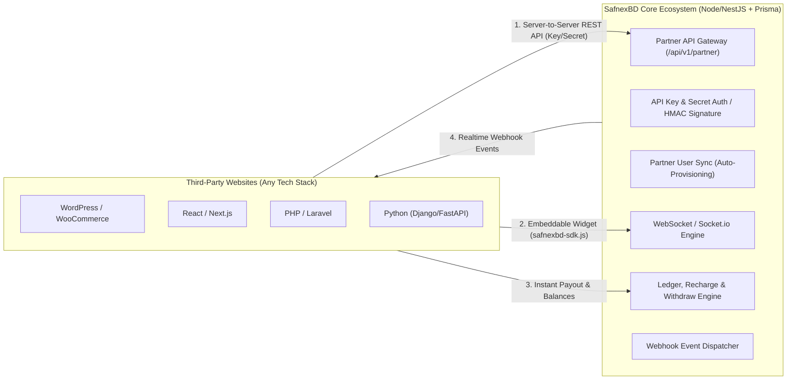
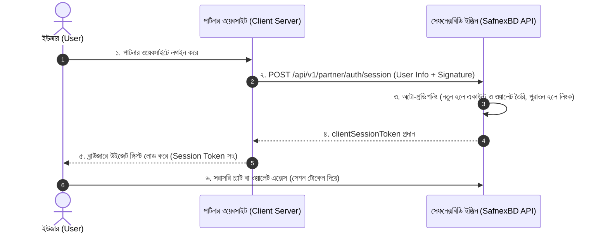

# 🌐 SafnexBD Cross-Platform Integration Architecture & Complete Technical Solution
### সেফনেক্সবিডি এপিআই (API) অন্য যেকোনো ওয়েবসাইট থেকে ব্যবহার করে চ্যাট, লেনদেন, রিচার্জ ও উইথড্র করার পূর্ণাঙ্গ গাইড

---

## ১. ভূমিকা ও কার্যপদ্ধতি ওভারভিউ (Executive Architecture Summary)

আপনি চাচ্ছেন আপনার **SafnexBD প্ল্যাটফর্মটি একটি কেন্দ্রীয় ইঞ্জিন (Core BaaS - Banking/Wallet-as-a-Service & Realtime Engine)** হিসেবে কাজ করবে। অন্য যেকোনো বাইরের ওয়েবসাইট (যাকে আমরা **Third-Party / Partner Website** বলব) সেফনেক্সবিডির API এবং SDK ব্যবহার করে তাদের নিজস্ব ওয়েবসাইট থেকেই:
1. **ইউজারকে কানেক্ট বা অটো-রেজিস্ট্রেশন করাতে পারবে।**
2. **লাইভ চ্যাট (Realtime Chat/Support/P2P) পরিচালনা করতে পারবে।**
3. **ওয়ালেট রিচার্জ (Wallet Recharge) করতে পারবে।**
4. **ওয়ালেট থেকে টাকা উত্তোলন (Withdrawal Request with OTP) করতে পারবে।**
5. **লেনদেন বা এসক্রো পেমেন্ট (Transaction / Escrow Deal) সম্পন্ন করতে পারবে।**

অন্য ওয়েবসাইটটি যে টেকনোলজি দিয়েই তৈরি হোক না কেন—**WordPress, React, Next.js, NestJS, Python (Django/FastAPI), অথবা PHP (Laravel/Core PHP)**—একটি স্ট্যান্ডার্ড REST API, WebSocket গেটওয়ে এবং Embeddable JavaScript SDK-এর মাধ্যমে এই সম্পূর্ণ ইকোসিস্টেমটি নির্বিঘ্নে পরিচালনা করা সম্ভব।



---

## ২. আমাদের ওয়েবসাইট (SafnexBD)-এ কী কী করতে হবে?

আমাদের মূল প্ল্যাটফর্মে থার্ড-পার্টি প্ল্যাটফর্মগুলোকে সেবা দেওয়ার জন্য নিচের কম্পোনেন্টগুলো যোগ করতে হবে:

### ক. মার্চেন্ট/পার্টনার ডেভেলপার পোর্টাল (`PartnerApp` মডেল)
ডাটাবেজে নতুন একটি মডেল তৈরি করতে হবে যা পার্টনার ওয়েবসাইটগুলোকে ট্র্যাক করবে:
- **`appId`**: ইউনিক আইডেন্টিফায়ার (যেমন: `app_live_8f7b2c...`)
- **`apiKey`**: পাবলিক কী (ফ্রন্টএন্ড SDK-র জন্য)
- **`apiSecret`**: প্রাইভেট সিক্রেট কী (শুধুমাত্র পার্টনারের ব্যাকএন্ড সার্ভারে সংরক্ষিত থাকবে)
- **`webhookUrl`**: পার্টনারের সার্ভার ইউআরএল যেখানে সেফনেক্সবিডি ইভেন্ট পাঠাবে
- **`allowedDomains`**: CORS সিকিউরিটির জন্য পার্টনারের ডোমেইন লিস্ট (যেমন: `https://clientstore.com`)
- **`status`**: `ACTIVE` বা `SUSPENDED`

### খ. অথেন্টিকেশন ও নিরাপত্তা আর্কিটেকচার
১. **Server-to-Server কল:** পার্টনার সার্ভার যখন সেফনেক্সবিডি এপিআইতে রিকোয়েস্ট পাঠাবে, তখন হেডারে পাঠাবে:
   - `X-Safnex-App-Id: app_xxxx`
   - `X-Safnex-Signature: hmac_sha256(request_body, apiSecret)`
   - `X-Safnex-Timestamp: 1695123456`
   *(এর ফলে কেউ রিকোয়েস্ট টেম্পার বা নকল করতে পারবে না)*
২. **Client-Side Session Token:** ফ্রন্টএন্ড উইজেট বা চ্যাট চালানোর জন্য পার্টনারের ব্যাকএন্ড সেফনেক্সবিডি থেকে একটি স্বল্পমেয়াদী (Short-lived 1 hour) **Client Session Token** চেয়ে নেবে। ব্রাউজারে কখনো পার্টনারের সিক্রেট কী উন্মুক্ত থাকবে না।

### গ. সিমলেস ইউজার রেজিস্ট্রেশন ও ম্যাপিং (Auto-Provisioning)
অন্য ওয়েবসাইটের ইউজারদের সেফনেক্সবিডিতে আলাদা করে ম্যানুয়াল রেজিস্ট্রেশন করার ঝামেলায় ফেলা যাবে না। 
- পার্টনারের ইউজার যখন তাদের সাইটে লগইন থাকবে, পার্টনারের সার্ভার সেফনেক্সবিডিকে বলবে:
  `"আমার সাইটের ইউজার আইডি 582, নাম: Rahim, ফোন: 01711111111, ইমেইল: rahim@gmail.com - এর জন্য সেশন দাও"`
- সেফনেক্সবিডি স্বয়ংক্রিয়ভাবে ডাটাবেজে চেক করবে:
  - এই পার্টনারের অধীনে `partnerUserId = 582` আছে কিনা।
  - না থাকলে সেফনেক্সবিডি নিমেষেই একটি ভার্চুয়াল ইউজার ও ডেডিকেটেড ওয়ালেট তৈরি করে নেবে।
  - থাকলে বিদ্যমান অ্যাকাউন্টের সাথে লিংক করে একটি সিকিউরড সেশন টোকেন রিটার্ন করবে।

### ঘ. প্রয়োজনীয় কোর এপিআই এন্ডপয়েন্ট (Partner Endpoints)

| ক্যাটাগরি | মেথড ও এন্ডপয়েন্ট | বিবরণ |
|---|---|---|
| **Auth & User** | `POST /api/v1/partner/auth/session` | পার্টনার ইউজারের জন্য ওয়ান-টাইম ক্লায়েন্ট সেশন টোকেন তৈরি |
| **Wallet** | `GET /api/v1/partner/wallet/balance` | ইউজারের Available ও Hold ব্যালেন্স যাচাই |
| **Recharge** | `POST /api/v1/partner/wallet/recharge/initiate` | রিচার্জ গেটওয়ে লিংক (bKash/Nagad/SSL) তৈরি |
| **Withdraw** | `POST /api/v1/partner/wallet/withdraw/request` | ওটিপি সহ বা অ্যাডমিন পর্যালোচনার জন্য উইথড্র রিকোয়েস্ট |
| **Escrow/Deal** | `POST /api/v1/partner/escrow/create` | নির্দিষ্ট ডিল বা লেনদেনের টাকা হোল্ড করা |
| **Escrow/Deal** | `POST /api/v1/partner/escrow/release` | ডিল সম্পন্ন হলে ফান্ড সেলারকে রিলিজ করা |
| **Chat** | `GET /api/v1/partner/chat/channels` | ইউজারের চ্যাট চ্যানেল ও রুমের তালিকা |
| **Chat** | `POST /api/v1/partner/chat/messages` | মেসেজ প্রেরণ (বা WebSocket দিয়ে লাইভ ট্রান্সমিট) |

### ঙ. এমবেডেবল জাভাস্ক্রিপ্ট SDK (`safnexbd-sdk.js`)
সেফনেক্সবিডির পাবলিক ডিরেক্টরিতে একটি লাইটওয়েট স্ক্রিপ্ট থাকবে। যেকোনো সাইট শুধু এই স্ক্রিপ্ট যুক্ত করলেই তাদের স্ক্রিনে চ্যাট ও ওয়ালেটের ফ্লোটিং বাটন চলে আসবে।

---

## ৩. অন্য ওয়েবসাইটে কীভাবে দেখাবে? (UI & UX Integration Mode)

অন্য যেকোনো ওয়েবসাইটে সেফনেক্সবিডির ফিচারগুলো ৩টি উপায়ে দেখানো সম্ভব:

### ১. ফ্লোটিং উইজেট মোড (Floating Chat & Wallet Widget - সর্বাধিক জনপ্রিয়)
* স্ক্রিনের নিচে ডানপাশে একটি স্টাইলিশ ফ্লোটিং বাটন থাকবে (যেমন Intercom বা Tawk.to)।
* ক্লিক করলে সুন্দর স্লাইড-ইন উইন্ডো খুলবে, যেখানে দুটি ট্যাব থাকবে:
  * **ট্যাব ১: লাইভ চ্যাট (Chat):** ক্রেতা-বিক্রেতা বা সাপোর্ট চ্যাট।
  * **ট্যাব ২: ওয়ালেট (Wallet):** বর্তমান ব্যালেন্স, ইনস্ট্যান্ট রিচার্জ বাটন এবং উইথড্র রিকোয়েস্ট বাটন।

### ২. মডাল পপআপ মোড (Popup Modal Checkout & Payout)
* পার্টনার সাইটে নিজস্ব বাটন থাকবে: `[ ৳ ৫০০ পে করুন (SafnexBD) ]` অথবা `[ ওয়ালেট রিচার্জ করুন ]` বা `[ মেসেজ পাঠান ]`।
* বাটনে ক্লিক করলে সেফনেক্সবিডির রেডিমেড আইফ্রেম বা মডাল ওপেন হয়ে ওটিপি ভেরিফিকেশন ও লেনদেন সম্পন্ন করবে।

### ৩. হেডলেস মোড (Headless Custom UI)
* পার্টনার সাইট তাদের নিজস্ব থিম ও কালার অনুযায়ী সম্পূর্ণ নিজস্ব ফর্ম ও চ্যাট বক্স বানাবে। ব্যাকগ্রাউন্ডে শুধু সেফনেক্সবিডির REST API এবং Socket.io কল হবে।

---

## ৪. ইউজার রেজিস্ট্রেশন কীভাবে কাজ করবে? (Single Sign-On / SSO Flow)

অন্য সাইটের ভিজিটরকে সেফনেক্সবিডির আলাদা রেজিস্ট্রেশন ফর্ম পূরণ করতে হবে না।



---

## ৫. বিভিন্ন টেকনোলজিতে কীভাবে সেটআপ ও কোড করতে হবে?

### ১. WordPress / WooCommerce ওয়েবসাইট

ওয়ার্ডপ্রেস সাইটে থিমের `functions.php` ফাইলে অথবা একটি ছোট কাস্টম প্লাগইনে কোডটুকু যোগ করতে হবে:

```php
<?php
// ১. সেফনেক্সবিডি সেশন টোকেন আনার ফাংশন
function get_safnexbd_session_token() {
    if (!is_user_logged_in()) return null;
    
    $current_user = wp_get_current_user();
    $api_url = 'https://safnexbd.com/api/v1/partner/auth/session';
    $app_id  = 'app_live_wp_123456';
    $secret  = 'sec_partner_secret_abcdef';

    $payload = json_encode([
        'partnerUserId' => (string)$current_user->ID,
        'name'          => $current_user->display_name,
        'email'         => $current_user->user_email,
        'phone'         => get_user_meta($current_user->ID, 'billing_phone', true) ?: ''
    ]);

    $signature = hash_hmac('sha256', $payload, $secret);

    $response = wp_remote_post($api_url, [
        'headers' => [
            'Content-Type'        => 'application/json',
            'X-Safnex-App-Id'    => $app_id,
            'X-Safnex-Signature' => $signature
        ],
        'body' => $payload
    ]);

    if (is_wp_error($response)) return null;
    $body = json_decode(wp_remote_retrieve_body($response), true);
    return $body['data']['sessionToken'] ?? null;
}

// ২. হেডারে স্ক্রিপ্ট ও উইজেট ইনজেক্ট করা
add_action('wp_footer', function() {
    $token = get_safnexbd_session_token();
    if (!$token) return;
    ?>
    <script src="https://safnexbd.com/sdk/safnexbd-sdk.js"></script>
    <script>
      window.SafnexBD.init({
        appId: 'app_live_wp_123456',
        sessionToken: '<?php echo esc_js($token); ?>',
        theme: 'dark',
        features: ['chat', 'wallet']
      });
    </script>
    <?php
});
```

---

### ২. PHP (Laravel) ওয়েবসাইট

**কন্ট্রোলার মেথড (`SafnexController.php`):**
```php
<?php
namespace App\Http\Controllers;

use Illuminate\Http\Request;
use Illuminate\Support\Facades\Http;
use Illuminate\Support\Facades\Auth;

class SafnexController extends Controller
{
    public function getSessionToken()
    {
        $user = Auth::user();
        $appId = config('services.safnex.app_id');
        $secret = config('services.safnex.api_secret');
        
        $data = [
            'partnerUserId' => (string)$user->id,
            'name'          => $user->name,
            'email'         => $user->email,
            'phone'         => $user->phone ?? ''
        ];

        $payload = json_encode($data);
        $signature = hash_hmac('sha256', $payload, $secret);

        $response = Http::withHeaders([
            'Content-Type'        => 'application/json',
            'X-Safnex-App-Id'    => $appId,
            'X-Safnex-Signature' => $signature
        ])->post('https://safnexbd.com/api/v1/partner/auth/session', $data);

        return response()->json($response->json());
    }

    // উইথড্র এপিআই কল (সার্ভার টু সার্ভার)
    public function requestWithdraw(Request $request)
    {
        $appId = config('services.safnex.app_id');
        $secret = config('services.safnex.api_secret');

        $payload = json_encode([
            'partnerUserId'      => (string)Auth::id(),
            'amount'             => $request->amount,
            'method'             => $request->method, // BKASH, NAGAD, BANK
            'destinationAccount' => $request->account_number,
            'otpCode'            => $request->otp_code
        ]);

        $signature = hash_hmac('sha256', $payload, $secret);

        $response = Http::withHeaders([
            'Content-Type'        => 'application/json',
            'X-Safnex-App-Id'    => $appId,
            'X-Safnex-Signature' => $signature
        ])->post('https://safnexbd.com/api/v1/partner/wallet/withdraw/request', json_decode($payload, true));

        return response()->json($response->json());
    }
}
```

---

### ৩. React / Next.js ওয়েবসাইট

**Next.js API Route (`app/api/safnex/session/route.ts`):**
```typescript
import { NextResponse } from 'next/server';
import crypto from 'crypto';

export async function POST(req: Request) {
  const sessionUser = await getServerSession(); // your auth
  if (!sessionUser) return NextResponse.json({ error: 'Unauthorized' }, { status: 401 });

  const payload = {
    partnerUserId: sessionUser.id,
    name: sessionUser.name,
    email: sessionUser.email,
    phone: sessionUser.phone || '',
  };

  const bodyString = JSON.stringify(payload);
  const signature = crypto
    .createHmac('sha256', process.env.SAFNEXBD_API_SECRET!)
    .update(bodyString)
    .digest('hex');

  const res = await fetch('https://safnexbd.com/api/v1/partner/auth/session', {
    method: 'POST',
    headers: {
      'Content-Type': 'application/json',
      'X-Safnex-App-Id': process.env.SAFNEXBD_APP_ID!,
      'X-Safnex-Signature': signature,
    },
    body: bodyString,
  });

  const data = await res.json();
  return NextResponse.json(data);
}
```

**React ফ্রন্টএন্ড কম্পোনেন্ট (`SafnexWidget.tsx`):**
```tsx
'use client';
import { useEffect } from 'react';

export default function SafnexWidget() {
  useEffect(() => {
    async function loadWidget() {
      const res = await fetch('/api/safnex/session', { method: 'POST' });
      const { data } = await res.json();

      if (data?.sessionToken) {
        const script = document.createElement('script');
        script.src = 'https://safnexbd.com/sdk/safnexbd-sdk.js';
        script.async = true;
        script.onload = () => {
          (window as any).SafnexBD.init({
            appId: process.env.NEXT_PUBLIC_SAFNEXBD_APP_ID,
            sessionToken: data.sessionToken,
            theme: 'dark',
            features: ['chat', 'wallet', 'escrow']
          });
        };
        document.body.appendChild(script);
      }
    }

    loadWidget();
  }, []);

  return null; // উইজেট স্ক্রিনের কোণায় স্বয়ংক্রিয়ভাবে ভেসে উঠবে
}
```

---

### ৪. Python (Django / FastAPI) ওয়েবসাইট

**FastAPI ব্যাকএন্ড সার্ভিস (`safnex_client.py`):**
```python
import hmac
import hashlib
import json
import httpx

SAFNEX_APP_ID = "app_live_py_998877"
SAFNEX_API_SECRET = "sec_partner_secret_12345"
SAFNEX_BASE_URL = "https://safnexbd.com/api/v1/partner"

async def get_user_safnex_session(user_id: str, name: str, email: str, phone: str):
    payload = {
        "partnerUserId": user_id,
        "name": name,
        "email": email,
        "phone": phone
    }
    body_bytes = json.dumps(payload).encode('utf-8')
    signature = hmac.new(SAFNEX_API_SECRET.encode('utf-8'), body_bytes, hashlib.sha256).hexdigest()

    headers = {
        "Content-Type": "application/json",
        "X-Safnex-App-Id": SAFNEX_APP_ID,
        "X-Safnex-Signature": signature
    }

    async with httpx.AsyncClient() as client:
        response = await client.post(f"{SAFNEX_BASE_URL}/auth/session", json=payload, headers=headers)
        return response.json()

# রিচার্জ লিংক তৈরি করা
async def initiate_recharge(user_id: str, amount: float):
    payload = {"partnerUserId": user_id, "amount": amount}
    body_bytes = json.dumps(payload).encode('utf-8')
    signature = hmac.new(SAFNEX_API_SECRET.encode('utf-8'), body_bytes, hashlib.sha256).hexdigest()

    async with httpx.AsyncClient() as client:
        res = await client.post(
            f"{SAFNEX_BASE_URL}/wallet/recharge/initiate",
            json=payload,
            headers={"X-Safnex-App-Id": SAFNEX_APP_ID, "X-Safnex-Signature": signature}
        )
        return res.json()
```

---

### ৫. NestJS ওয়েবসাইট (Microservices / Modular Backend)

**NestJS সার্ভিস (`safnex.service.ts`):**
```typescript
import { Injectable, Logger } from '@nestjs/common';
import { HttpService } from '@nestjs/axios';
import * as crypto from 'crypto';
import { firstValueFrom } from 'rxjs';

@Injectable()
export class SafnexService {
  private readonly appId = process.env.SAFNEX_APP_ID;
  private readonly secret = process.env.SAFNEX_API_SECRET;
  private readonly baseUrl = 'https://safnexbd.com/api/v1/partner';

  constructor(private readonly http: HttpService) {}

  private generateSignature(payload: any): string {
    return crypto
      .createHmac('sha256', this.secret)
      .update(JSON.stringify(payload))
      .digest('hex');
  }

  async createChatSession(user: { id: string; name: string; email: string }) {
    const payload = {
      partnerUserId: user.id,
      name: user.name,
      email: user.email,
    };

    const signature = this.generateSignature(payload);

    const { data } = await firstValueFrom(
      this.http.post(`${this.baseUrl}/auth/session`, payload, {
        headers: {
          'Content-Type': 'application/json',
          'X-Safnex-App-Id': this.appId,
          'X-Safnex-Signature': signature,
        },
      }),
    );

    return data;
  }
}
```

---

## ৬. ওয়েবহুক (Webhook) সিস্টেম – রিয়েলটাইম আপডেট গ্রহণ

পার্টনার ওয়েবসাইটে ব্যালেন্স আপডেট, পেমেন্ট কনফার্মেশন ও উইথড্র রেজাল্ট নিশ্চিত করতে সেফনেক্সবিডি স্বয়ংক্রিয়ভাবে পার্টনারের Webhook URL-এ নোটিফিকেশন পাঠাবে।

### পার্টনারে Webhook হ্যান্ডলার (Node/Express বা Next.js উদাহরণ):
```typescript
app.post('/api/safnex-webhook', (req, res) => {
  const signature = req.headers['x-safnex-signature'];
  const expectedSig = crypto
    .createHmac('sha256', process.env.SAFNEXBD_API_SECRET)
    .update(JSON.stringify(req.body))
    .digest('hex');

  // ১. সিগনেচার যাচাই
  if (signature !== expectedSig) {
    return res.status(401).send('Invalid signature');
  }

  const event = req.body;

  // ২. ইভেন্ট অনুসারে ব্যবস্থা
  switch (event.type) {
    case 'WALLET_RECHARGE_SUCCESS':
      // পার্টনারের নিজস্ব ডাটাবেজে ইউজারের ব্যালেন্স স্ট্যাটাস আপডেট করুন
      console.log(`User ${event.data.partnerUserId} recharged ৳${event.data.amount}`);
      break;

    case 'WITHDRAWAL_APPROVED':
      console.log(`Withdrawal for ${event.data.partnerUserId} processed successfully!`);
      break;

    case 'NEW_CHAT_MESSAGE':
      // পার্টনারের লোকাল পুশ নোটিফিকেশন ট্রিগার করা
      break;
  }

  res.status(200).json({ received: true });
});
```

---

## ৭. ধাপে ধাপে বাস্তবায়ন অ্যাকশন প্ল্যান (Implementation Roadmap)

| ধাপ | কাজ | কী কী তৈরি হবে |
|---|---|---|
| **ধাপ ১** | **SafnexBD Partner Core Module** | `PartnerApp` প্রিজমা মডেল, API Key ও Secret জেনারেশন এবং সিক্রেট ভ্যালিডেশন মিডলওয়্যার। |
| **ধাপ ২** | **SSO & User Sync Endpoint** | `/api/v1/partner/auth/session` তৈরি, যা পার্টনার ইউজারকে তাৎক্ষণিক সেফনেক্সবিডি ভার্চুয়াল অ্যাকাউন্টে কনভার্ট করবে। |
| **ধাপ ৩** | **Partner Wallet & Chat Gateways** | ব্যালেন্স চেক, রিচার্জ ইনিশিয়েট, ওটিপি-সহ উইথড্র এবং চ্যাট মেসেজিং এন্ডপয়েন্ট তৈরি। |
| **ধাপ ৪** | **Embeddable JS SDK (`safnexbd-sdk.js`)** | লাইটওয়েট ফ্রন্টএন্ড স্ক্রিপ্ট যা ক্লায়েন্ট পেজে ফ্লোটিং চ্যাট ও ওয়ালেট উইজেট রেন্ডার করবে। |
| **ধাপ ৫** | **Developer Portal & Documentation** | অ্যাডমিন প্যানেলে নতুন মার্চেন্ট/পার্টনার অনবোর্ডিং, কী ম্যানেজমেন্ট এবং কোড স্নsnippet ভিউয়ার তৈরি। |

---

## ৮. চূড়ান্ত সিদ্ধান্ত (Conclusion & Recommendation)

এই আর্কিটেকচার অনুযায়ী কাজ করলে:
1. **যেকোনো প্ল্যাটফর্ম** (WordPress, Laravel, React, Next.js, Python, মোবাইল অ্যাপ) মাত্র **কয়েক লাইনের কোড বসিয়ে** সেফনেক্সবিডির চ্যাট, রিচার্জ, উইথড্র ও এসক্রো ট্রানজ্যাকশন ব্যবহার করতে পারবে।
2. **ইউজারদের আলাদা করে সাইন-আপ করতে হবে না**, সিঙ্গেল সাইন-অন (SSO) ও অটো-প্রভিশনিংয়ের কারণে ব্যবহারকারীর অভিজ্ঞতা হবে একদম নিরবচ্ছিন্ন ও দ্রুত।
3. আপনার সেফনেক্সবিডি কেবল একটি ওয়েবসাইট হিসেবে সীমাবদ্ধ না থেকে একটি **শক্তিশালী ফিনটেক ও এসক্রো গেটওয়ে প্ল্যাটফর্ম**-এ রূপান্তরিত হবে।

